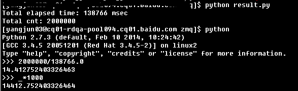

ZMQ-based-benchmarktesttool
===========================

基于ZMQ(分布式消息队列)的性能测试工具。    

### 特色:
* 基于ZMQ，ZMQ号称史上最快的消息内核，性能优异，ZMQ官网链接：http://zeromq.org/。   消息队列性能测试对比：http://kb.cnblogs.com/page/100982/。
* 支持同步异步模式，同步接口异步化，解除客户端接口类型为异步的限制。
* 支持分布式，可在多核、多进程、多机器上轻松扩展。可使用ZMQ socket通信模型比较容易的构建轻量级的mapreduce框架。
* 使用python开发性能测试工具前提下，ZMQ模式可以充分利用机器资源，python多线程无法利用多核资源，python多进程队列性能性能明显低于ZMQ方式，且无法向多机器扩展。
* 跨语言、跨平台，可使用python快速原型验证之后扩展为其他语言，支持C++, C#, CL, Delphi, Erlang, F#, Felix, Haskell, Java, Objective-C, Ruby, Ada, Basic, Clojure, Go, Haxe, Node.js, ooc, Perl, and Scala等几乎所有语言。
* 高性能，使用工具demo测试用户偏好http接口，QPS约15000左右，截图如下：    
 

     
初步demo开发完成，后续逐步完善...
